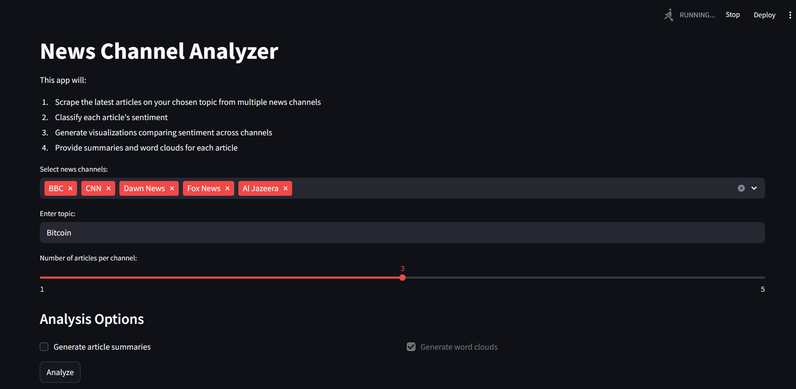
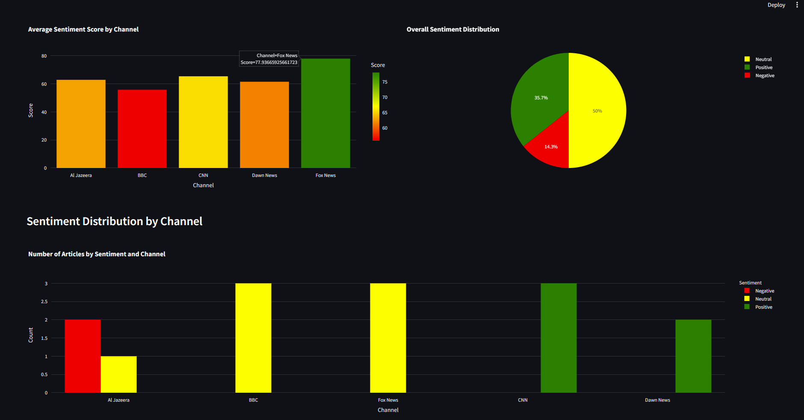

# News Channel Analyzer

A Streamlit web app to analyze and compare news coverage across major international news channels using Natural Language Processing (NLP).

## Features

- **Scrape news articles** on any topic from multiple channels:
  - BBC
  - CNN
  - Dawn News
  - Fox News
  - TRT News
  - Al Jazeera
- **Classify sentiment** of each article using state-of-the-art NLP models.
- **Generate summaries** for each article.
- **Create word clouds** and extract keywords.
- **Visualize sentiment** across channels with interactive charts.

---

## Demo

### App Interface


### Example Output


---

## Installation

1. **Clone the repository:**
   ```bash
   git clone <your-repo-url>
   ```

2. **Install dependencies:**
   ```bash
   pip install -r requirements.txt
   ```

   > **Note:**
   > - You need Python 3.8 or newer.
   > - Chrome browser is required for scraping (Selenium uses ChromeDriver).
   > - On first run, large NLP models will be downloaded automatically.

---

## Usage

1. **Run the Streamlit app:**
   ```bash
   streamlit run app.py
   ```

2. **Open your browser** to the local URL shown (usually http://localhost:8501).

3. **Select news channels, enter a topic, and choose the number of articles per channel.**

4. **Click "Analyze"** to start scraping and analysis.

---

## Project Structure

```
project/
├── app.py            # Main Streamlit app
├── scrapers.py       # Scraping logic for all channels
├── utils.py          # NLP utilities (sentiment, summary, word cloud)
├── requirements.txt  # Python dependencies
├── scraping/         # Channel-specific scrapers (for reference)
└── ...
```

---

## Troubleshooting

- **Selenium/ChromeDriver errors:**
  - Make sure Google Chrome is installed.
  - ChromeDriver is managed automatically by `webdriver-manager`.
- **Model download issues:**
  - Ensure you have a stable internet connection on first run.
- **Timeouts or missing articles:**
  - Some sites may block scraping or change their layout. Try again later or with a different topic.
- **Performance:**
  - The first run may be slow due to model downloads and browser startup.

---


## Acknowledgments

- [Streamlit](https://streamlit.io/)
- [HuggingFace Transformers](https://huggingface.co/transformers/)
- [Selenium](https://www.selenium.dev/)
- [Plotly](https://plotly.com/python/)
- [WordCloud](https://github.com/amueller/word_cloud) 
